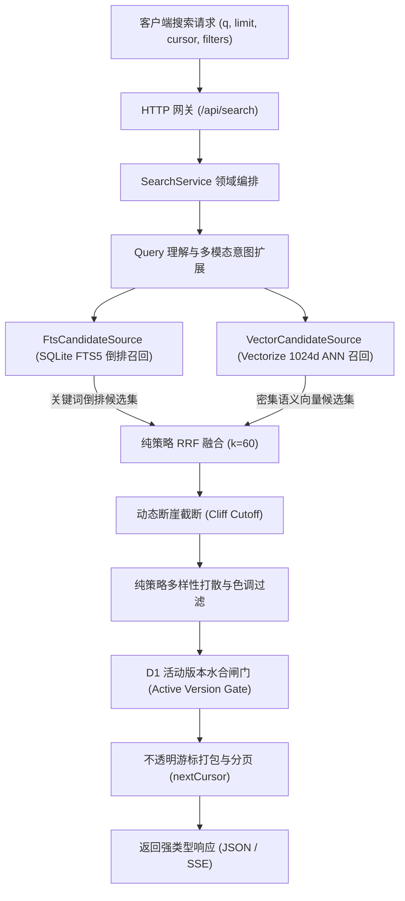
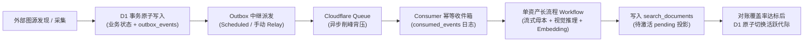

# Lens 系统架构与边缘检索设计规约

更新日期：2026-09-19
状态：现行
适用范围：Lens 宏观系统拓扑、边缘混合检索内核、异步采集流水线、状态机编排与治理边界

Lens 是部署于 Cloudflare 边缘环境的多模态混合检索系统。系统严格基于 **[ADR-0006](decisions/0006-single-worker-cloudflare-native-refactor.md)** 确立的**单 Worker Cloudflare 原生模块化单体（Modular Monolith）**基线演进，在 Serverless 边缘环境（内存限制 128MB、执行时间片受限、外部 API 配额有限）的严苛约束下，内聚 API 网关、队列消费、定时调度与长流程持久化工作流，实现极致低延迟与长期可复算的数据自治。

---

## 1. 宏观架构：单 Worker 模块化单体模型

Lens 采用 **“每环境单计算进程，按职责严格分层”** 的单 Worker 模块化单体架构。所有计算入口收敛在 `@lens/engine`，避免跨 Worker RPC 的网络与序列化开销：

```text
                                  [客户端 HTTP / Cron 调度 / Queue 队列 / Workflow 引擎]
                                                             │
                                                             ▼
                                             ┌──────────────────────────────┐
                                             │      统一触发器分派入口      │
                                             │        (entrypoints/)        │
                                             └──────────────┬───────────────┘
                                                            │
                     ┌───────────────────────┬──────────────┴───────────────┬──────────────────────┐
                     ▼                       ▼                              ▼                      ▼
               [http.ts 网关]        [scheduled.ts 调度]             [queue.ts 消费]        [workflow.ts 编排]
                     │                       │                              │                      │
                     └───────────────────────┴──────────────┬───────────────┴──────────────────────┘
                                                            │ 模块间调用
                                                            ▼
                                             ┌──────────────────────────────┐
                                             │       核心领域自治模块       │
                                             │          (modules/)          │
                                             └──────────────┬───────────────┘
                                                            │
         ┌──────────────────┬──────────────────┬────────────┴───────┬──────────────────┬──────────────────┐
         ▼                  ▼                  ▼                    ▼                  ▼                  ▼
     [catalog]         [ingestion]      [representation]        [indexing]        [retrieval]        [operations]
   (聚合根/可见性)   (ACL/Master写入)   (视觉推理/Embedding)   (版本化搜索文档)  (候选源/RRF/水合)   (权威配置/审计)
         │                  │                  │                    │                  │                  │
         └──────────────────┴──────────────────┴────────────┬───────┴──────────────────┴──────────────────┘
                                                            │
                                                            ▼
                                             ┌──────────────────────────────┐
                                             │      领域内核与平台适配      │
                                             │     (kernel/ & platform/)    │
                                             └──────────────────────────────┘
```

### 1.1 内核化检索管道 (Retrieval Kernel Pipeline)

检索管道遵循稳定、无副作用的纯策略设计：



1. **CandidateSource 双路隔离**：SQLite FTS5 与 Vectorize (BGE-M3, 1024 维) 封装为标准候选源，任一路超时或限流均自动静默降级，绝不阻断检索；
2. **纯策略互惠排名融合 (RRF)**：使用无状态纯函数根据 $\frac{1}{k + \text{rank}}$ 合并多源排名（默认 $k=60$）；
3. **断崖截断 (Dynamic Cutoff)**：分析候选得分序列，当相对变化率小于 65% 或跌破绝对底线时动态截断；
4. **D1 活动版本水合闸门**：所有外部向量候选必须回 D1 主库执行存在性与版本过滤，确保未激活或草稿资产绝对不对外暴露；
5. **稳定游标分页 (`cursor`)**：基于查询指纹与偏移量生成 URL 安全的不透明游标，杜绝传统裸 offset 的数据漂移。

### 1.2 异步摄取与发件箱边界 (Asynchronous Pipeline & Outbox)

系统通过事务发件箱与收件箱保障全链路异步最终一致性：



- **事务性发件箱 (Transactional Outbox)**：业务变更与领域事件必须在 D1 同一事务批次内提交，由 Queue Consumer 异步中继；
- **消费者幂等凭据 (Consumer Inbox)**：通过 `consumed_events` 表持久化消费凭据，吸收队列重试与乱序投递；
- **长流程持久化 (Workflows)**：单资产处理使用确定性实例 ID（`process:{assetId}:{pipelineVersion}`），保障步骤断点恢复。

---

## 2. 规范 Master 归档与线性对撞采集

### 2.1 长期归档战略 (Canonical Master)

为了保证未来 5~6 年更换视觉模型与表征时不依赖外部第三方图源，系统在 R2 中存储规范母本：

- **存储规格**：`media/{contentHash}/master.{ext}`；
- **流式 SHA-256 计算**：通过 Web Crypto API 执行单遍流式哈希计算，零内存缓冲；
- **40MB 内存守卫**：检测超出 40MB 的异常大文件并立即中断管道，杜绝边缘 OOM；
- **内容寻址去重**：若相同哈希已存在，自动复用并删除暂存文件。

### 2.2 线性边界对撞模型 (Linear Boundary Collision)

外部图源采集器按时间轴倒序扫描，一旦命中 D1 中已记录的边界资产立即熔断退出，最大限度节约外部 API 配额。

---

## 3. 分布式可观测性与控制面隔离

### 3.1 路由暴露面分离

- **`/api/*`**：公共业务 API，统一参数校验、速率限制（60次/分）与标准错误包装；
- **`/image/*`**：R2 媒体直读强缓存代理（ETag 与不可变缓存）；
- **`/internal/*`**：**内部管理面**（严格受 Cloudflare Access 身份或服务令牌保护），提供：
  - `GET /internal/health`：深层系统依赖与活动代际诊断；
  - `GET/POST /internal/reconciliation`：Outbox 堆积与索引覆盖率对账；
  - `GET/POST /internal/config`：权威运行时配置变更与操作审计；
  - `POST /internal/outbox/relay`：手动触发 Outbox 批次派发。

### 3.2 链路追踪指纹

系统全面遵循 W3C Trace Context 规范，自动附加链路上下文：

- `SEARCH-xxxx`：用户端到端搜索链路；
- `CRON-xxxx`：定时对账与发现批次；
- `WF-xxxx`：单资产长流程状态机；
- `INTERNAL-xxxx`：高风险管理面操作。

---

## 4. 异步批处理并发架构 (Queue + Workflow Concurrency)

| 调度参数            | 配置值 | 含义                                            |
| :------------------ | :----- | :---------------------------------------------- |
| `max_batch_size`    | 5      | 每个 Queue Consumer 实例每批次最多拉取 5 条消息 |
| `max_batch_timeout` | 30s    | 批次等待聚合超时时间                            |
| `max_concurrency`   | 5      | 最大并发运行的 Queue Consumer 实例数            |

- **单图处理流程**：约 2.5 ~ 3.5 秒（涵盖 R2 流式拉取、规范 Master 校验、多模态视觉属性推理、BGE-M3 向量化、D1 + Vectorize 写入）；
- **故障隔离与可恢复性**：每个 Workflow 步骤状态（Download, Master, Vision, Embedding, Commit）均可重试。

---

## 5. 存储架构与多模态模型协作

| 业务处理阶段     | 使用模型 / 组件       | 技术职责                                          |
| :--------------- | :-------------------- | :------------------------------------------------ |
| **视觉属性理解** | Llama 视觉多模态模型  | 提取图片构图标签、语义摘要描述与结构化命名实体    |
| **查询意图扩展** | Llama 3.2 3B Instruct | 针对口语化或跨语言查询生成标准视觉检索联想词      |
| **向量化基座**   | BGE-M3 (1024 维)      | 生成跨模态文本特征稠密向量，映射至多语言语义空间  |
| **关键词倒排**   | SQLite FTS5           | 处理确定性关键词、作者名称与高频标签匹配          |
| **权威持久化**   | Cloudflare D1         | 权威存储资产聚合、发件箱/收件箱、搜索文档与审计   |
| **向量持久化**   | Cloudflare Vectorize  | 存储版本化稠密向量投影（返回候选必须回 D1 水合）  |
| **规范 Master**  | Cloudflare R2         | 规范原始 Master 与 Web 展示切片持久化内容寻址存储 |

---

## 6. 核心架构不变量 (Architecture Invariants)

1. **D1 是唯一事实源**：资产存在性、发布可见性、活动版本与系统配置均以 D1 记录为准；
2. **候选必须回表水合**：Vectorize 与 FTS5 仅为候选召回器，未在 D1 中激活的资产绝不曝光；
3. **规范 Master 不可变归档**：R2 必须保留可复算的 Master，支持未来模型与索引全量重建；
4. **无跨存储裸双写**：跨存储变更强制在 D1 同一事务内写入聚合状态与 Outbox 事件；
5. **版本化索引与平滑代际切换**：全量重建必须写入新 `index_generation`，校验通过后在 D1 原子激活。
