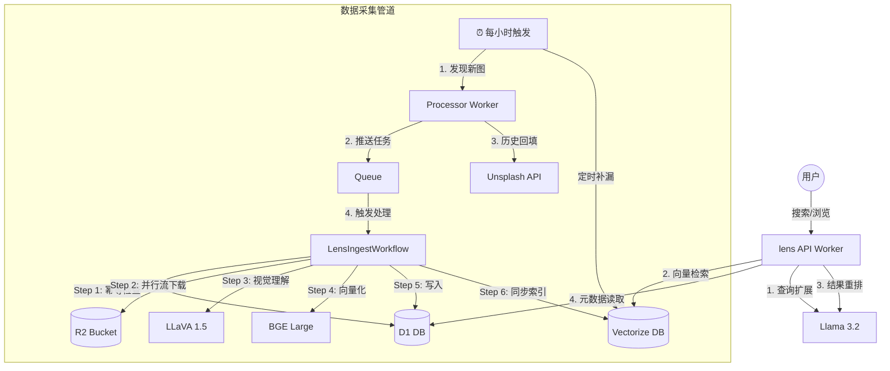

# Lens v6.0 系统架构设计 (System Design Document)

本文档详细描述了 Lens v6.0 的双管道架构设计、双向贪婪采集算法、多层搜索增强策略及存储方案。

## 1. 核心架构

系统被划分为两个独立的管道，通过 **Cloudflare Queue** 实现削峰填谷。

## 2. 采集算法：双向贪婪模型 (Bi-Directional Greedy Ingestion)

这是本项目的核心算法，旨在 Unsplash 每小时 50 次配额限制下，实现最大化吞吐量。

### Phase 1: 向前追赶 (Forward Catch-up)
- **目标**: 确保系统始终拥有最新的图片。
- **逻辑**: 从第 1 页开始抓取，直到遇到数据库中存储的 `last_seen_id`。
- **霸道更新**: 只要第 1 页成功获取，**立即**更新 `last_seen_id`。即使后续入队失败，下次运行也会从最新的位置开始，绝不回头补漏。

### Phase 2: 向后回填 (Backward Backfill)
- **目标**: 利用剩余配额挖掘历史数据。
- **分页偏移修正 (Timeline Shift Correction)**: 
    - 算法会自动计算 Phase 1 抓取到的新图数量。
    - 公式: `backfill_page += Math.floor(new_photos / 30)`。
    - **原理**: 由于 Unsplash 是按时间倒序排列，新图的加入会导致历史图向后“漂移”。修正后可完美避免重复抓取已入库的图。
- **配额耗尽策略**: 持续抓取，直到 API 剩余配额为 1。

## 3. 搜索算法：多层智能增强

系统不只是简单的向量匹配，而是采用了工业级的搜索漏斗：

1.  **查询扩展 (Query Expansion)**: 使用 Llama 3.2 对 4 词以内的短搜索词进行增强，自动翻译为英文并增加视觉关联词。
2.  **初筛 (Vector Retrieval)**: 通过 BGE Large 1024 维向量在 Vectorize 中进行初筛，获取 Top 100 候选。
3.  **重排 (LLM Re-ranking)**: 将 Top 50 的 AI 描述和元数据传给 Llama 3.2，根据用户查询词进行相关性排序。
4.  **混合评分 (Hybrid Scoring)**: 重排后的前 20 名获得位置权重分，其余保留原始向量相似度分。

## 4. 数据一致性与防护

- **Workflow 守门员**: Workflow 的第一个 Step 是 `check-exists`。这确保了在回填模式下，如果任务重复，会瞬间跳过昂贵的 AI 推理。
- **流式 R2 写入**: 下载 50MB+ 的 RAW 图时，直接使用 `response.body` 对接到 `R2.put`，确保 Worker 不会 OOM。
- **Unsplash 合规**: 自动触发 Unsplash 下载跟踪端点，符合其 API 使用政策。

## 5. 存储策略

| 路径 | 格式 | 用途 | 缓存策略 |
| --- | --- | --- | --- |
| `/raw/{id}.jpg` | 原图 (RAW) | 存档与高质量下载 | 1 年 (Immutable) |
| `/display/{id}.jpg` | 1080p (Regular) | 前端展示与 AI 分析 | 1 年 (Immutable) |
