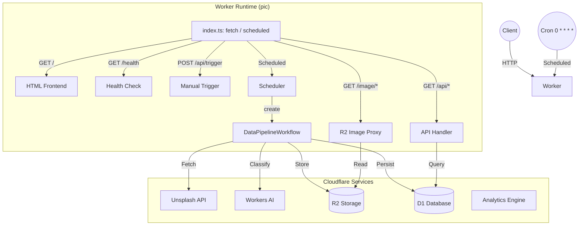

# 🏗️ Architecture

Single Cloudflare Worker (`pic`) handling frontend, API, scheduling, and workflows.

## Module Interaction



## Modules

### Entry (`src/index.ts`)
- `fetch` handler: routes HTTP requests to API, HTML, image proxy, or health endpoints.
- `scheduled` handler: triggers `EnqueuePhotosTask` then creates `DataPipelineWorkflow`.

### Workflows (`src/workflows/`)
- **DataPipelineWorkflow** (`data-pipeline.ts`): main orchestration — enqueue, download, classify, store.
- **DownloadWorkflow** (`download-workflow.ts`): batch image downloads from Unsplash to R2 temp storage.
- **ClassifyWorkflow** (`classify-workflow.ts`): batch AI classification of downloaded images.

Each workflow extends `WorkflowEntrypoint<Env>` with typed `WorkflowStep` operations and step-level retries.

### Tasks (`src/tasks/`)
- `enqueue-photos.ts`: fetch Unsplash API, deduplicate against D1, insert into ProcessingQueue.
- `process-photo.ts`: orchestrate single photo download → classify → store → persist.
- `fetch-photos.ts`, `extract-exif.ts`, `save-metadata.ts`, `classify-with-model.ts`: granular task units.

### Services (`src/services/`)
- `unsplash.ts`: Unsplash API client.
- `ai-classifier.ts`: Cloudflare AI model invocation.
- `downloader.ts`: image download and R2 upload.

## Data Model

### D1 Tables

| Table | Purpose |
|-------|---------|
| `Photos` | Photo metadata, EXIF, location, AI classification, photographer info |
| `ProcessingQueue` | Task queue with per-step success flags and retry tracking |
| `GlobalStats` | Aggregate counters (photos, storage bytes, workflows, downloads) |
| `CategoryStats` | Per-category photo counts |
| `WorkflowRuns` | Workflow execution history |
| `ApiQuota` | API rate limit tracking (Unsplash: 50/hour) |
| `CleanupLog` | Data retention cleanup records |
| `State` | Key-value config (cursor position, retention settings) |

### Key TypeScript Interfaces (`src/types.ts`)

```typescript
interface PhotoRow {
  unsplash_id: string;
  r2_key: string;
  ai_category: string | null;
  ai_confidence: number | null;
  width: number;
  height: number;
  color: string;
  likes: number;
  photographer_name: string;
  downloaded_at: string;
}

interface GlobalStatsRow {
  id: number;
  total_photos: number;
  total_storage_bytes: number;
  total_categories: number;
  total_workflows: number;
  successful_workflows: number;
  failed_workflows: number;
  total_downloads: number;
  successful_downloads: number;
  skipped_downloads: number;
  updated_at: string;
}
```

### Env Bindings (`src/env.d.ts`)

| Binding | Type | Resource |
|---------|------|----------|
| `DB` | D1Database | `pic-d1` |
| `R2` | R2Bucket | `pic-r2` |
| `AI` | Ai | Workers AI |
| `AE` | AnalyticsEngineDataset | `pic-ae` |
| `PHOTO_WORKFLOW` | Workflow | `DataPipelineWorkflow` |
| `UNSPLASH_API_KEY` | string | Secret |

### R2 Key Strategy

```
{category}/{unsplash_id}.jpg
```

Temporary downloads stored at `temp/{unsplash_id}.jpg` before classification.

## Scalability

- **Frontend split**: if UI traffic grows, the `fetch` handler can be extracted to a separate Worker sharing D1/R2 read access.
- **Queue integration**: Cloudflare Queues can be inserted between scheduler and pipeline for backpressure.
